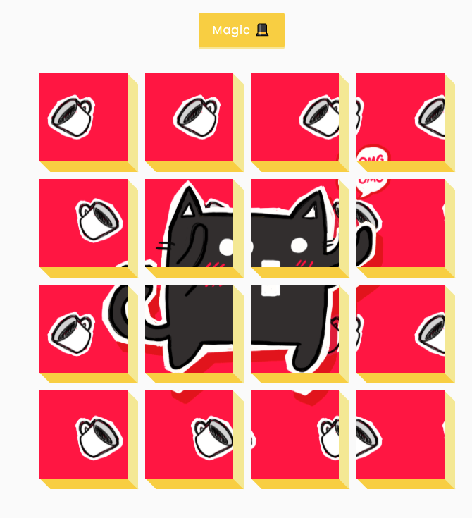

# 40 day 3D Background Boxes

By pressing the button, split the gif image into several elements. Using ::before and ::after pseudo-elements for 3D effect images, background-position property for positioning images.

[DEMO](https://voloshin-sergei.github.io/50_days/40_day%203D%20Background%20Boxes/)
