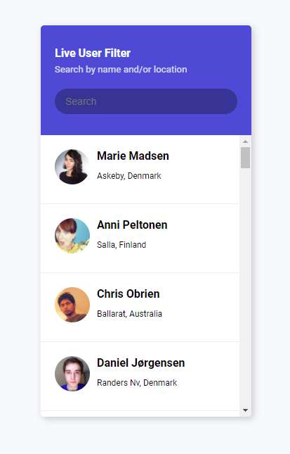

# 42 day Live User Filter

We take data from the randomuser.me api service, and display a list of users. We can also filter the list by name or location.

[DEMO](https://voloshin-sergei.github.io/50_days/42_day%20Live%20user%20filter/)
