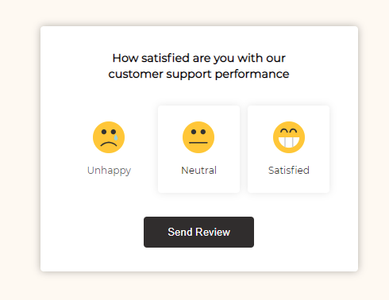

# 43 day Feedback UI Design

A simple example of feedback and the use of bubbling. Click on the emotion and the send button, we get a feedback message. Using bubbling events.

[DEMO](https://voloshin-sergei.github.io/50_days/43_day%20Feedback%20UI%20design/)
