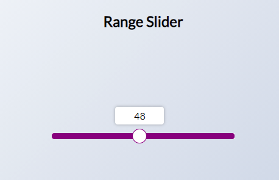

# 44 day Range Slider

Clicking custome range slider. The label follows the slider and shows the value. Using getComputedStyle() method, getPropertyValue, and custom function which allows you to convert a number that falls within a range of numbers into a number within a different range.

[DEMO](https://voloshin-sergei.github.io/50_days/44_day%20Range%20slider/)
