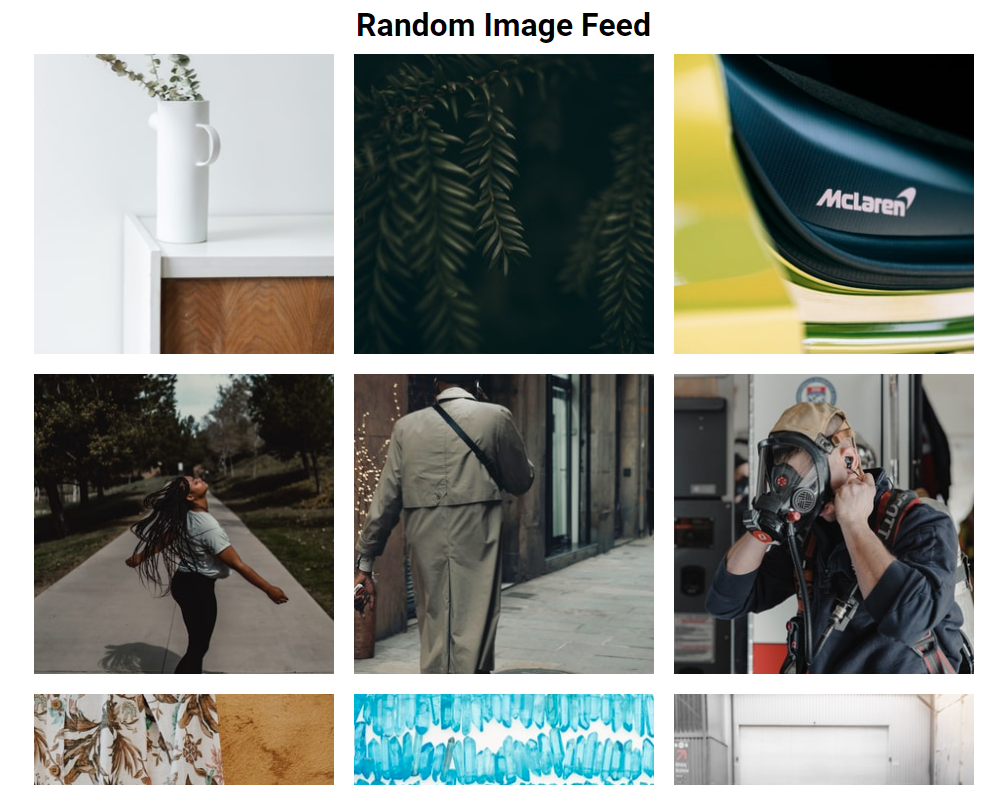

# 48 day Random Image Feed

An example of a simple image gallery, without using the API, using a resource https://source.unsplash.com/random/ and Math.random().

[DEMO](https://voloshin-sergei.github.io/50_days/48_day%20Random%20image%20feed/)
